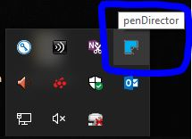
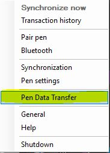
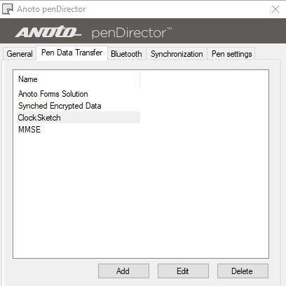
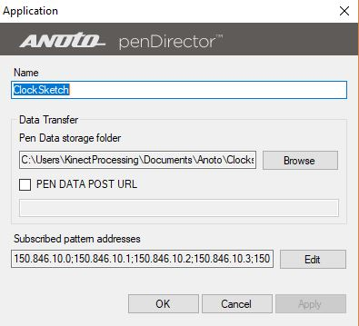
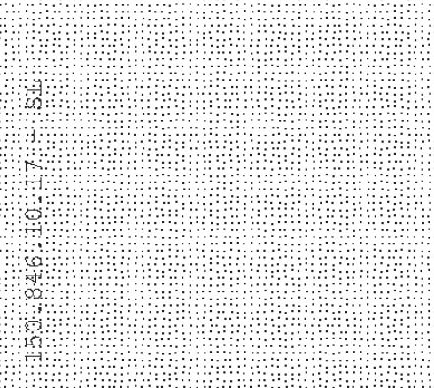
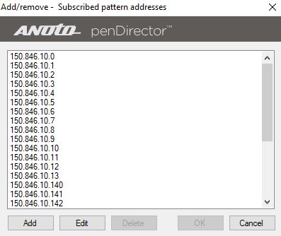

# Rush_Digi_Paper

## Print own Digital Paper for use with the MIT ClockSketch consortium projects.

> This guide assumes you have the MIT ClockSketch program installed with all dependencies and software including Anoto PenDirector and the Anoto SDK used with the ClockSketch Program

>This guide is completed using a windows 10 machine but should be able to transfer to any windows system

## 1. Set up PenDirector
First we must set up the correct file structure for collecting the pen data on the PenDirector program. 
* If you right click on the penDirector in the windows dock you will get a menu.

* Select the Pen Data Transfer option to open the transfer settings window

* You should see a window that looks similar to this, but with only *Anoto Forms Solution* amd *Synched Encrypted Data*

* Click **Add** to add a new transfer protocol

* You can set name and location to what will work in your individual use case. 
    -  this is where the raw .pgc file will be stored.

* The **Subscribed pattern addresses** is the individual page addresses of our own printed paper located in the [Paper](Paper) folder

    

Click **Edit** and paste these patterns 
> 150.846.10.0;
150.846.10.1;
150.846.10.2;
150.846.10.3;
150.846.10.4;
150.846.10.5;
150.846.10.6;
150.846.10.7;
150.846.10.8;
150.846.10.9;
150.846.10.10;
150.846.10.11;
150.846.10.12;
150.846.10.13;
150.846.10.140;
150.846.10.141;
150.846.10.142;
150.846.10.143;
150.846.10.144;
150.846.10.145;
150.846.10.146;
150.846.10.147;
150.846.10.148;
150.846.10.149;
150.846.10.150;
150.846.10.151;
150.846.10.152;
150.846.10.153

Now when a digital pen is docked it will save the .pgc files from your own printed paper in the specified location
> You other paper will still work as it has before

## 2. Convert .pgc files
Now that the .pgc are stored in a specified location we must convert those to a usable file format.

* Under the [Scripts](scripts) directory there are the three scripts used to convert the .pgc files.
    * ExtractPgcDataByPage.txt is the basic script to convert the .pgc to a readable txt
    * StartMonitoringClock.ps1 is a modification of that ps script to monitor the folders where the .pgc are saved and convert when a new file is detected while still saving raw as a backup.
    * clock_single_transform.py is a python script that converts the txt to a .csk (the file type used in a clock sketch program).
        * there is some corrections in this scrpt to the cooridant system that was found using a grid set-up on both own printed paper and ClockSketch offical paper. 

## Appendix. 
- Printer used to print paper
> [HP Laserjet 600 M602](https://support.hp.com/us-en/product/hp-laserjet-enterprise-600-printer-m602-series/5145285/product-info "HP Printer used")

